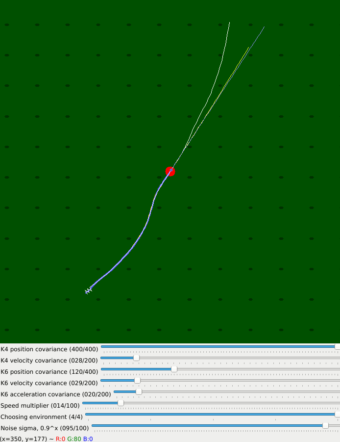

# Simple benchmark for 6- and 4- state Kalman Filters

This repository contains some a Proof Of Concept, that shows that shows that using K4 for ball but K6 for robots makes sense. Also, it outlines the importance of the careful tuning of Kalman Filter.



### Installation
```pip3 install -r requirements.txt```

(Obviously, in venv. Or not. Depends on your mood)

### Legend
* Yellow trace - Slowly-decreasing-acceleration Kalman filter
* Blue trace - Constant velocity Kalman Filter
* White trace - "true" path
* Black trace - "true" path disturbed with Gaussian noise
* Yellow/Blue/White circles - predicted system states after one dt (~18 ms)
* Red circle - current "true" state


### Usage
Run ```python3 main.py $i```, where ```$i``` is 0, 1, 2 or 3 corresponding to different environments.

During excecution, press:
- Esc - to exit
- Space - to pause
- k or l - to move forward in time
- h or j - to move backward in time
- 1,2,3,4,5,6 - to switch visibility of a particular trace
- v - switches local camera view to global
- \+ - zoom in
- \- - zoom out

### Notes
* For the last environment, the one that is "extracted", with extracted robot behaviour, most of the scrollbars don't have effect.
* Covariance scrollbars take effect after about 100 iterations, which is equivalent to second and a half
* Evidently, the 6-state KF is superior
* Black little lines are "marks" so that with dynamic camera viewpoint you still can make sense of the movement. It is buggy with high zoom. Distance between two marks is 25cm - approximatly size of the robot
